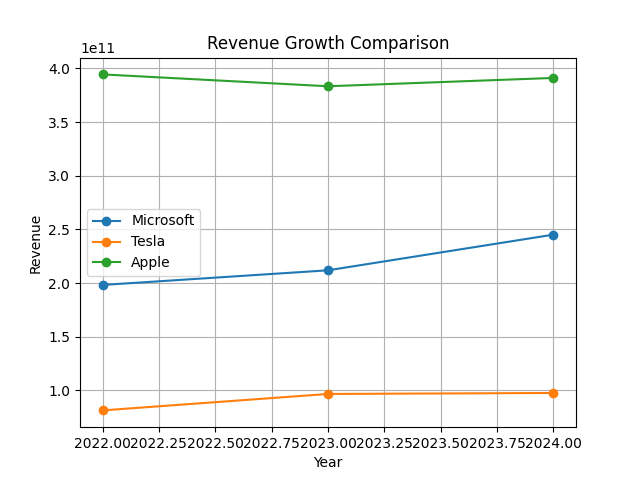
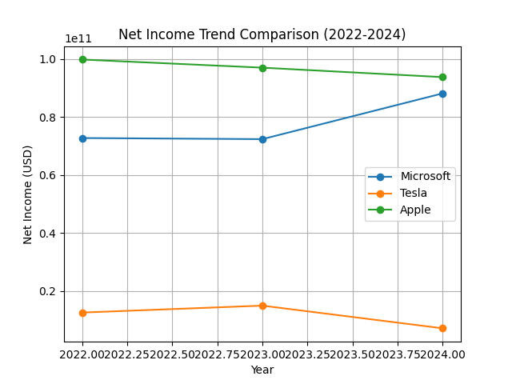
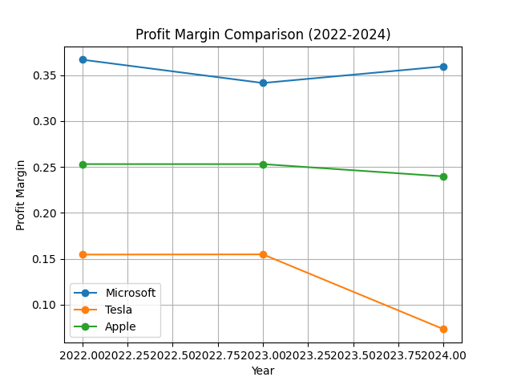
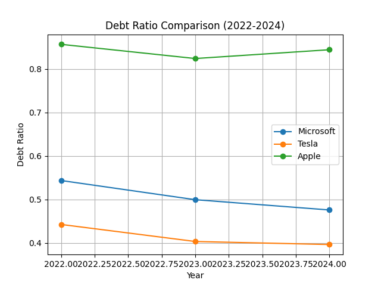
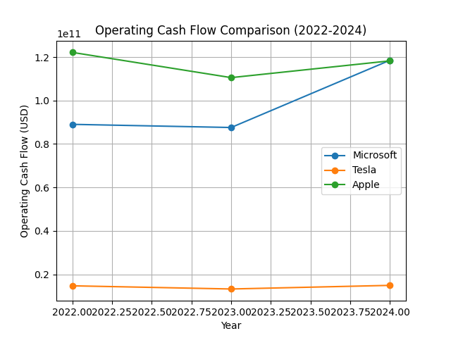

# Apple, Tesla, and Microsoft Financial Analysis

## Project Overview

This project analyzes the financial performance of three major technology companies:

- Apple
- Tesla
- Microsoft

The analysis focuses on key financial metrics including revenue growth, profitability, financial leverage, and operating cash flow.

The objective of this project is to demonstrate financial data analysis using **Python, Pandas, Matplotlib, Excel, and Tableau**.

---

## Dataset

The dataset contains financial data from **2022 to 2024**, including:

- Total Revenue
- Net Income
- Total Assets
- Total Liabilities
- Operating Cash Flow

Each record represents the financial performance of a company in a specific year.

---

```

## Project Structure

apple-tesla-microsoft-financial-analysis

charts
├── revenue_growth.png
├── net_income_trend.png
├── profit_margin_trend.png
├── debt_ratio_trend.png
└── cashflow_trend.png

dataset
└── financial_data.csv

outputs
├── revenue_data.csv
├── net_income_data.csv
├── profit_margin_data.csv
├── debt_ratio_data.csv
└── cashflow_data.csv

scripts
├── analysis.py
├── revenue_analysis.py
├── net_income_analysis.py
├── profit_margin_analysis.py
├── debt_ratio_analysis.py
└── cashflow_analysis.py

FINANCIAL_PERFORMANCE_ANALYSIS:_APPLE_VS_MICROSOFT_VS_TESLA_(2022-2024).PNG

README.md

requirements.txt

```

---

## Financial Analysis

### Revenue Analysis

Analyzes company revenue trends and compares revenue growth across companies.

### Net Income Analysis

Evaluates company profitability and its changes over time.

### Profit Margin Analysis

Measures business efficiency.

Formula:

Profit Margin = Net Income / Revenue

### Debt Ratio Analysis

Measures financial leverage and company risk.

Formula:

Debt Ratio = Total Liabilities / Total Assets

### Operating Cash Flow Analysis

Evaluates the company's ability to generate cash from operations.

---

## Data Visualization

### Revenue Growth Comparison



### Net Income Trend



### Profit Margin Comparison



### Debt Ratio Comparison



### Operating Cash Flow Trend



---

## Tableau Dashboard

An interactive dashboard was created using **Tableau** to visualize the financial performance of Apple, Tesla, and Microsoft.

The dashboard includes:

- Revenue comparison
- Profit margin analysis
- Debt ratio comparison
- Cash flow trends

Dashboard file can be found in the **dashboard** folder.

---

## Tools and Technologies

- Python
- Pandas
- Matplotlib
- Excel
- Tableau

---

## How to Run the Project

### 1 Clone the repository

git clone https://github.com/zakkyakbar/apple-tesla-microsoft-financial-analysis.git

### 2 Install dependencies

pip install pandas matplotlib

### 3 Run the analysis

python scripts/analysis.py

---

## Key Insights

- Apple generates the highest revenue among the analyzed companies.
- Microsoft shows stable financial growth and strong profitability.
- Tesla demonstrates rapid revenue growth but higher volatility compared to the others.

---

## Project Purpose

This project demonstrates:

- Financial data analysis
- Data cleaning and preprocessing
- Financial ratio analysis
- Data visualization

This project was developed as part of my **Data Analyst and Financial Analyst portfolio** to demonstrate the ability to analyze financial datasets and extract meaningful insights.

